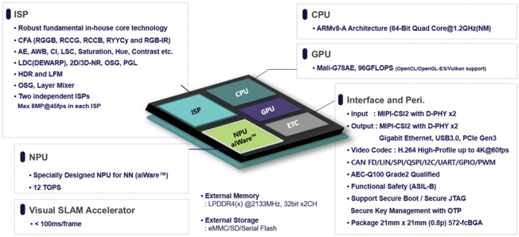

# Terminology

이미지에 등장하는 주요 시스템 및 프로세서 관련 핵심 용어 정리는 다음과 같습니다.

**주요 프로세서 및 프로세싱 유닛**

* **ISP (Image Signal Processor):** 카메라 센서로부터 들어온 raw 영상 데이터를 보정하여 화질 개선, 색상 보정, 노이즈 제거 등을 수행하는 영상 처리 전용 장치입니다.
* **CPU (Central Processing Unit):** 전체 시스템의 제어, 연산, 데이터 처리 및 운영체제 운영을 담당하는 중앙 처리 장치입니다.
* **GPU (Graphics Processing Unit):** 그래픽 처리 및 그래픽 기반의 수많은 병렬 계산 연산을 고속으로 처리하는 프로세서입니다.
* **NPU (Neural Processing Unit):** 인공지능(AI) 심층 신경망(NN) 연산 처리에 특화된 전용 반도체로, 빠른 자율주행 알고리즘 연산을 돕습니다.
* **Visual SLAM Accelerator:** Visual SLAM(카메라 영상 기반의 실시간 위치 추정 및 지도 작성 기술)의 연산 부담을 줄이고 처리 속도를 극대화하는 전용 가속기입니다.

---

**시스템 주요 사양 및 기술 용어**

* **Euro NCAP:** 유럽 신차 평가 프로그램으로, 신차의 안전성을 종합 평가하는 표준 규격입니다.
* **ADAS L2/L2+ (Advanced Driver Assistance Systems):** 첨단 운전자 보조 시스템입니다. L2는 조향 및 가감속 보조, L2+는 고도화된 고속도로 주행 보조 등 제어 영역이 확장된 수준의 자율주행을 의미합니다.
* **NN (Neural Network):** 인간의 뇌 신경망을 모방하여 학습 및 판단을 가능하게 하는 인공지능 신경망 알고리즘입니다.
* **TOPS (Trillion Operations Per Second):** 초당 1조 번의 연산을 처리할 수 있는 NPU 성능 단위입니다.

---

**ISP 관련 영상 처리 제어 용어**

* **CFA (Color Filter Array):** 이미지 센서의 컬러 필터 배열 패턴 방식입니다 (RGGB, RCCG, RCCB, RYYCy, RGB-IR 등).
* **AE / AWB / CI:** 자동 노출(Auto Exposure), 자동 화이트 밸런스(Auto White Balance), 색상 수용(Color Integration) 조정 기능입니다.
* **LSC / Saturation / Hue / Contrast:** 렌즈 음영 보정(Lens Shading Correction), 채도, 명도/색상, 명암비 조정 기능입니다.
* **LDC (Lens Distortion Correction / DEWARP):** 광각 렌즈 등에서 발생하는 외곽 왜곡 현상을 평평하게 펼치는 보정 기술입니다.
* **2D/3D-NR (Noise Reduction):** 공간(2D) 및 시간(3D) 프레임 기반 노이즈 제거 기술입니다.
* **HDR (High Dynamic Range) & LFM (LED Flicker Mitigation):** 밝은 곳과 어두운 곳을 동시에 명확히 표현하는 기술(HDR) 및 LED 전조등/신호등의 깜빡임 현상을 억제하는 기술(LFM)입니다.
* **OSG / Layer Mixer:** 화면 상에 그래픽/텍스트 데이터를 겹쳐 띄우는 기술(On-Screen Graphics) 및 영상 레이어 합성 기능입니다.

---

**인터페이스 및 전장 표준 규격**

* **MIPI-CSI2 (D-PHY):** 카메라 센서와 영상 처리 장치 간의 고속 데이터 전송 표준 인터페이스입니다.
* **CAN FD / LIN / SPI / QSPI / I2C / UART / GPIO / PWM:** 차량 내부 통신 및 주변 장치 제어용 데이터 송수신 표준 규격 통신 인터페이스들입니다.
* **AEC-Q100 Grade2 Qualified:** 차량용 반도체 신뢰성 시험 규격으로, 폭넓은 온도 및 환경 조건 내 동작을 보증하는 등급입니다.
* **Functional Safety (ASIL-B):** 자동차 기능 안전성 국제 표준(ISO 26262) 중 ASIL-B 등급의 안전 기준을 준수함을 의미합니다.
* **Secure Boot / Secure JTAG / OTP:** 불법적인 소프트웨어 변조를 방지하고, 디버깅 보안 및 암호화 키 관리(OTP 메모리 기반)를 수행하는 보안 솔루션입니다.
* **LPDDR4(x):** 전력 소비가 적은 차세대 모바일/차량용 저전력 DRAM 메모리 규격입니다.

---
## SLAM

### **Visual SLAM 및 가속기(Accelerator) 개요**

Visual SLAM(Simultaneous Localization and Mapping)은 카메라로 촬영한 영상 데이터를 바탕으로 주변 환경의 지도 작성(Mapping)과 차량의 현재 위치 추정(Localization)을 실시간으로 동시에 수행하는 기술입니다.

이미지 내에서 특징점(Feature)을 추출 및 추적하고, 3D 좌표 보정 및 루프 폐쇄(Loop Closure) 등의 행렬 연산 작업을 계속 수행하므로 매우 높은 컴퓨팅 자원을 소모합니다.

이를 전용 하드웨어인 **Visual SLAM Accelerator**로 가속할 때 얻을 수 있는 주요 이점은 다음과 같습니다.

---

### **Visual SLAM Accelerator 탑재 시 기대 효과**

* **실시간성 보장 (초저지연성):**
가속기를 활용하면 프레임당 처리 시간을 100ms 미만(< 100ms/frame) 수준으로 낮춰, 고속 주행 시에도 돌발 상황이나 환경 변화에 지연 없이 즉각 반응할 수 있습니다.
* **주요 연산 장치(CPU/NPU)의 부하 절감:**
기존에 CPU나 NPU가 담당하던 3D 행렬 연산 및 특징점 추출 부하를 가속기가 전담 처리합니다. 이로 인해 여유가 생긴 CPU/NPU 자원을 인공지능 경로 계획, 객체 인지 등 다른 핵심 자율주행 알고리즘에 할당할 수 있습니다.
* **전력 효율 증대 (Low Power):**
범용 CPU/GPU로 복잡한 수학 연산을 지속하는 것보다 전용 HW 가속기를 통하는 것이 전력 소모 및 발열 측면에서 대단히 유리합니다. 이는 차량용 시스템의 안정성을 극대화합니다.
* **음영 지역 및 GPS 불가 구간에서의 위치 추정 정밀도 향상:**
터널, 지하 주차장, 도심 빌딩 숲 등 GPS 신호가 끊기는 환경에서도 프레임 손실(Frame Drop) 없이 고속으로 안정된 정밀 위치 추정을 유지합니다.
