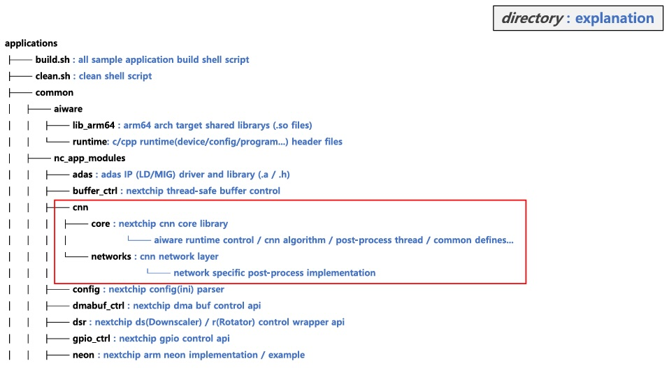
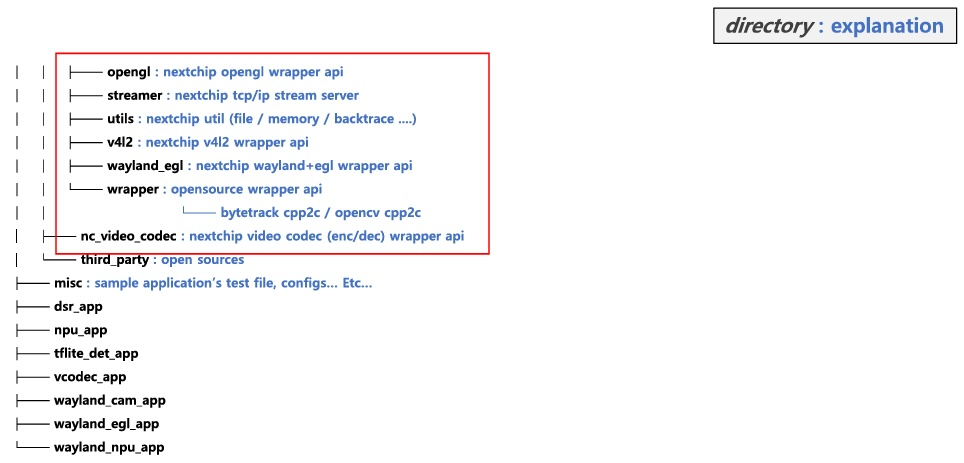
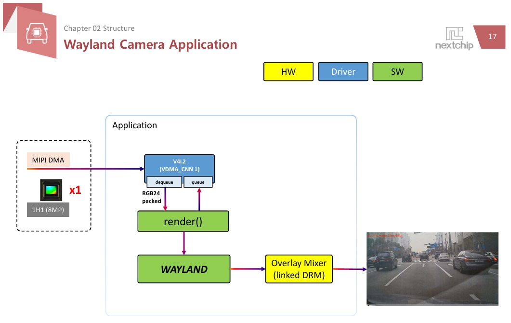
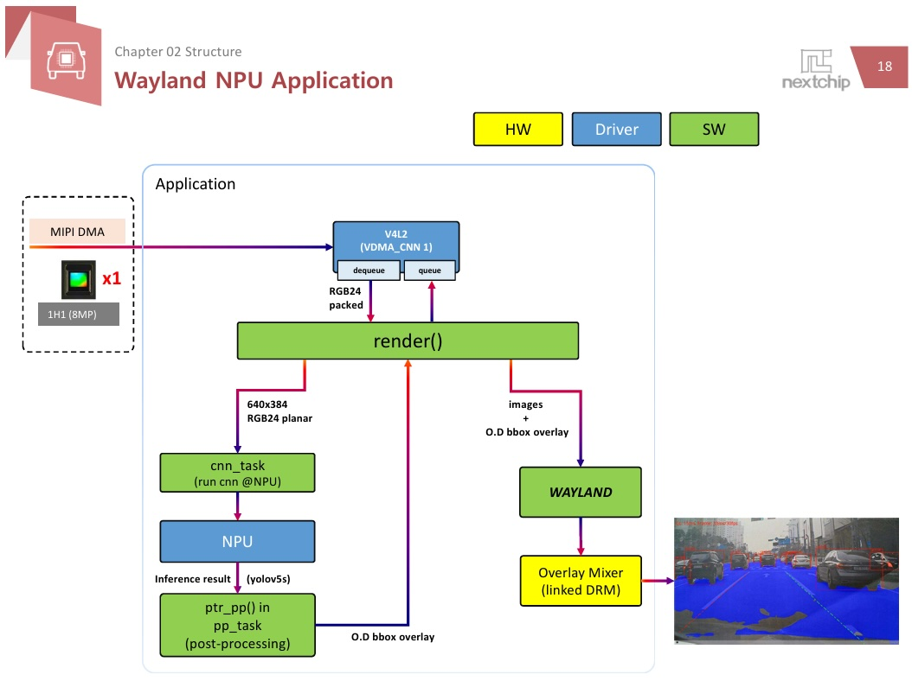

# 변경 해야 할 내용

## [ nc_module.ini ]

- **파일 위치** : 보드의 `/mnt/user_data/applications/`

### 내용

- nc_module_load.sh 이 참조하는 initializer 파일
- 주요 내용
  - image sensor 종류
  - serializer
  - deserializer
  
  - vision0 / vision1의 camera ch 수

### 변경 할 내용

- image_sensor_v0, image_sensor_v1

```bash
image_sensor_v0 = s5k3b6
image_sensor_v1 = s5k3b6
```

- totalch_v0, totalch_v1

  ```bash
  totalch_v0 = 1
  totlach_v1 = 1
  ```

## [ camera를 사용하는 app의 코드 수정 ]

### 변경 할 내용

- channel 관련 정보

  ```bash
  #define VIS0_MAX_CH         (1)
  #define VIS1_MAX_CH         (0)
  ```

## [ Application 폴더 tree 구조 및 설명 ]





## [ 분석 할 Application ]

### 1. Wayland Camera Application

- **간단 설명** : 1H1(8MP) 1ch 영상을 입력 받아서 wayland 출력하는 샘플 애플리케이션
- **Source Code :** (SDK Root)/applications/wayland_cam_app.c
- **코드 간단 개요**



### 2. Wayland NPU Application

- **간단 설명 :** 1H1(8MP) 1ch 영상을 입력 받아서 NPU를 통해Inference(Object Detection + Freespace + Lane Detection)를 수행하고영상위에인식결과를mix후, wayland출력하는 샘플 애플리케이션
- **소스 코드 :** (SDK Root)/applications/wayland_npu_app
- **소스 코드 개요**

