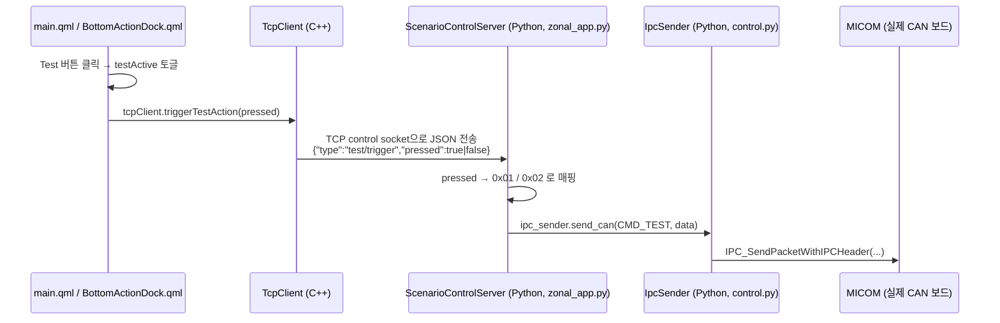

# Test 버튼 → CAN 전송 기능 정리

이 문서는 대시보드 하단 dock에 추가한 **Test 버튼**이 어떻게 CAN(IPC) 전송까지 이어지는지,
그리고 어떤 파일을 고치면 되는지를 정리한 것이다. 코드에서 `TEST-BUTTON` 으로 검색하면
아래 모든 변경 지점을 바로 찾을 수 있다.

```
grep -rn "TEST-BUTTON" TOPST_Education/btn_Zonal_Application
```

## 1. 전체 흐름 (아키텍처)



핵심 원칙: **C++/QML은 "버튼이 눌렸다/풀렸다"는 의미만 전달**하고,
**실제 CAN ID(0x101)와 데이터 값(0x01/0x02) 매핑은 Python 브리지 쪽에서만 관리**한다.
(속도/조향값을 주기적으로 보내는 CMD_WHEEL=0x103, CMD_MOTOR=0x102 도 같은 방식으로
Python `IpcSender`가 전담하고 있어서 구조를 통일했다.)

## 2. 파일별 변경 사항

### 2.1 QML (UI)

- [qml/components/BottomActionDock.qml](btn_Zonal_Application/TOPST_DashBoard/qml/components/BottomActionDock.qml)
  - 하단 액션 목록(`model`)에 `{ icon: "🧪", label: "Test" }` 추가.
  - `property bool testActive: false` 추가 — 다른 탭 버튼(`app.activeTab`)과 별개로
    Test 버튼만의 눌림/해제 상태를 표시하기 위함.
  - 각 버튼 delegate에서 `highlighted` 값을 계산할 때, label이 `"Test"`이면
    `dock.testActive`를, 그 외에는 기존처럼 `app.activeTab === index`를 사용.

- [qml/main.qml](btn_Zonal_Application/TOPST_DashBoard/qml/main.qml)
  - `property bool testActive: false` 추가 (토글 상태의 원본).
  - `BottomActionDock { testActive: root.testActive }` 로 바인딩해서 버튼 표시에 반영.
  - `onActionTriggered`에서 `label === "Test"`일 때:
    ```qml
    root.testActive = !root.testActive
    tcpClient.triggerTestAction(root.testActive)
    ```

### 2.2 C++ (Qt 대시보드)

- [tcpclient.h](btn_Zonal_Application/TOPST_DashBoard/tcpclient.h) /
  [tcpclient.cpp](btn_Zonal_Application/TOPST_DashBoard/tcpclient.cpp)
  - `Q_INVOKABLE void triggerTestAction(bool pressed);` 추가.
  - 구현은 기존 `selectScenario()`와 동일한 패턴: control host/port(`controlHost_`,
    `controlPort_`, 기본 `127.0.0.1:10001`)로 짧게 TCP 연결해서 JSON 한 줄을 보내고 바로 끊는다.
  - 전송 JSON: `{"type":"test/trigger","pressed":true}` 또는 `pressed:false`.
  - 연결 실패/전송 실패 시 `qWarning()`으로 로그를 남긴다
    (예: `CAN control connect failed: Connection refused` → 브리지가 안 떠 있다는 뜻).

### 2.3 Python 브리지 (Bridge_App)

- [bev_lane_modules/scenario.py](btn_Zonal_Application/Bridge_App/bev_lane_modules/scenario.py)
  - `ScenarioControlServer.__init__`에 `ipc_sender=None` 파라미터 추가 → CAN 전송에 사용.
  - `_accept_loop()`: 클라이언트 접속 시 `print(f"[zonal-test][CTRL] client connected from {addr}")`
    → **Qt와 TCP 연결 자체가 되는지** 확인용 로그.
  - `_handle_payload()`:
    - 수신한 JSON 원본을 그대로 `print(f"[zonal-test][CTRL] received: {message}")` 로 출력
      → **JSON 파싱까지 잘 되는지** 확인용 로그.
    - `msg_type == "test/trigger"` 분기 추가:
      - `ipc_sender`가 없으면 (`--can-enable` 옵션이 꺼져 있는 경우) 경고 로그를 남기고 무시.
      - `pressed` 값에 따라 `data_value = 0x01 if pressed else 0x02` 로 CAN 데이터를 결정.
      - `print(f"[zonal-test][CTRL] test button {'pressed'|'released'} -> sending data=0x..")`
        → **어떤 값(01/02)이 전송되는지** 확인용 로그.
      - `self.ipc_sender.send_can(CMD_TEST, bytes([data_value]))` 호출.

- [bev_lane_modules/control.py](btn_Zonal_Application/Bridge_App/bev_lane_modules/control.py)
  - `CMD_TEST = 0x101` 상수 추가 (`CMD_WHEEL=0x103`, `CMD_MOTOR=0x102` 다음 번호).
  - `IpcSender.send_can(can_id, data)` 메서드 추가:
    - 주기 제한(`period_ms`) 없이 즉시 전송 — Test 버튼처럼 단발성 명령에 사용.
    - IPC 핸들이 아직 안 열려 있으면(`--can-enable` 꺼짐 등)
      `print("[zonal-test][CAN] send skipped (IPC handle not open): ...")` 로 원인을 남기고 리턴.
    - 정상 전송되면 `print("[zonal-test][CAN] IPC_SendPacketWithIPCHeader sent id=... data=...")`
      → **실제 IPC 디바이스에 write가 일어났는지** 확인용 로그.

- [zonal_app.py](btn_Zonal_Application/Bridge_App/zonal_app.py)
  - `ScenarioControlServer(...)` 생성 시 `self.ipc_sender`를 함께 전달하도록 수정
    (`can/send`·`test/trigger` 명령을 처리하려면 IPC 송신기 참조가 필요하기 때문).

## 3. 통신이 되는지 확인하는 방법 (디버깅)

브리지(`zonal_app.py --can-enable ...`)를 실행한 터미널 로그에서 버튼을 누를 때마다
아래 3줄이 순서대로 찍히는지 확인하면 된다.

```
[zonal-test][CTRL] client connected from ('127.0.0.1', 51234)
[zonal-test][CTRL] received: {'type': 'test/trigger', 'pressed': True}
[zonal-test][CTRL] test button pressed -> sending data=0x01
[zonal-test][CAN] IPC_SendPacketWithIPCHeader sent id=0x101 data=0x01
```

- `client connected` 로그가 안 뜨면 → Qt(C++)가 control socket에 접속조차 못 하는 상태.
  (`Connection refused` 등은 브리지 미실행/포트 불일치, [config.json](btn_Zonal_Application/TOPST_DashBoard/config.json)의
  `control_port`와 브리지 실행 옵션 `--control-port`가 일치하는지 확인)
- `received:` 로그는 뜨는데 `test button ...` 로그가 없다면 → JSON의 `type` 값이
  `"test/trigger"`가 아니거나 오타가 있는 경우.
- `send skipped (IPC handle not open)` 로그가 뜨면 → 브리지를 `--can-enable` 없이 실행했거나
  IPC 디바이스(`/dev/tcc_ipc_micom`) open에 실패한 상태. `IpcSender.start()`가
  호출됐는지, `--ipc-path`가 올바른지 확인.
- 마지막 `IPC_SendPacketWithIPCHeader sent ...` 까지 찍히면 Qt → 브리지 → IPC 까지
  정상적으로 데이터가 전달된 것이다 (MICOM이 실제로 처리했는지는 보드 쪽 로그로 별도 확인 필요).

## 4. 앞으로 비슷한 버튼/명령을 추가하고 싶다면

1. **QML**: `BottomActionDock.qml`의 `model` 배열에 버튼 항목 추가, 필요하면 토글 상태용
   `property bool` 을 하나 더 만들어 `highlighted` 계산에 분기 추가.
2. **main.qml**: `onActionTriggered`에서 새 `label`을 분기 처리하고, `tcpClient`에
   새 `Q_INVOKABLE` 메서드를 호출.
3. **C++ (tcpclient.h/cpp)**: `selectScenario()` / `triggerTestAction()` 과 동일한 패턴으로
   새 메서드를 추가 — control socket에 짧게 연결해서 의미 있는 JSON(`type` 필드로 구분)만 보낸다.
   **CAN ID나 데이터 바이트 값을 C++/QML에 넣지 말 것** — 브리지에서만 관리한다.
4. **scenario.py `_handle_payload()`**: 새 `msg_type` 분기 추가, 필요한 값만 꺼내서
   `ipc_sender`의 적절한 메서드 호출. 디버깅용 `print`를 넣어 두면 이후 문제 추적이 쉬워진다.
5. **control.py**: 새 CAN ID 상수 추가, 필요하면 `IpcSender`에 전용 전송 메서드 추가
   (`send_can()`을 그대로 재사용해도 된다).
